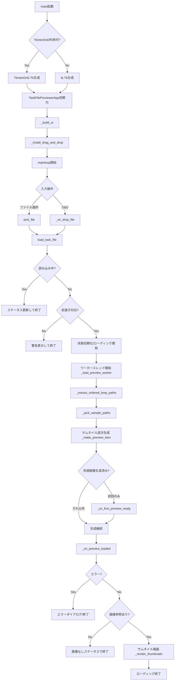
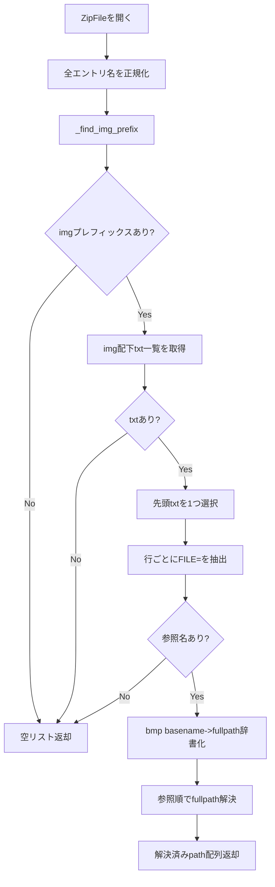
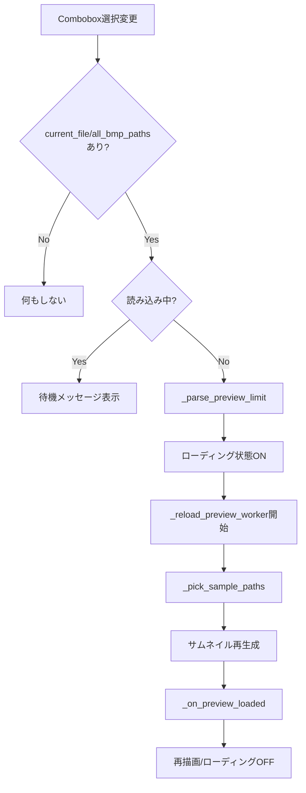
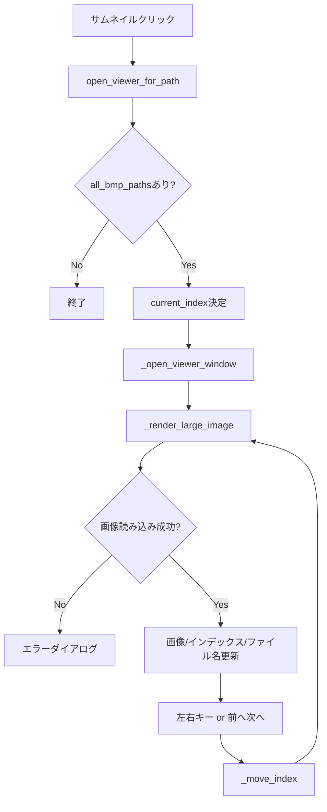
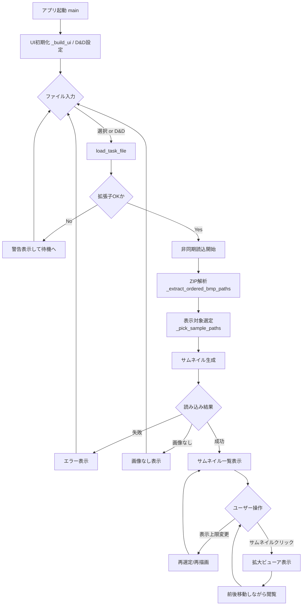

# task_file_previewer.py フローチャート

後から見た人が処理の流れを追いやすいように、主要フローを分割して記述します。  
（Mermaid対応ビューアで図として表示できます）

## 1. アプリ全体フロー（起動〜初回表示）

## 2. ZIP内画像参照の抽出フロー（_extract_ordered_bmp_paths）

## 3. 表示上限変更フロー（_on_preview_limit_changed）

## 4. 拡大ビューア表示フロー

## 5. 統合図（簡略版・1枚）

## 補足（設計上のポイント）

- UIフリーズ回避のため、重い処理は `_load_preview_worker` / `_reload_preview_worker` で別スレッド実行。
- UI更新は `root.after(0, ...)` 経由でメインスレッドに戻して安全に反映。
- `_load_seq` で「古い読み込み結果」を無効化し、連続操作時の表示競合を防止。
- 先頭サムネイルを先出し表示し、体感待ち時間を短縮。
